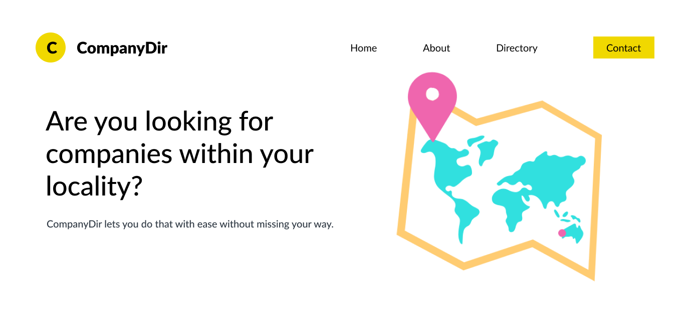

# Company Directory Listing
> The CompanyDir is a one-page, mobile-friendly, interactive web app to check various companies and their details.Information about a company is shown on a map and a table. The information include the name, sector, location, stock, and their fees. The datatable supports search, sorting, and filtering to access information faster. The map comes with a pop-up to view details by clicking on the map marker.

## Table of content
- Pre-build plan
- Technologies used

## Pre-build plan
- Website sketches bearing in mind the mobile view of the website.
- Choose colors and create website layout.
- Choose between Tailwind and Bootstrap for website design. Selected Bootstrap due to the readily available components and time.
- Choose framework. Selected ReactJs over Jquery due to the availability of reliable NPM packages to take care of the map section.
- Selected Google maps over Mapbox since it is easier and free to get the API with a common Gmail account - selected MUI datatables package to handle the large data and ensure better mobile display

## Technologies used
- HTML, CSS and Javascript
- Bootstrap
- ReactJs

## Installation
See the [Build.md](Build.md) document.